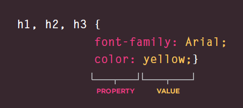
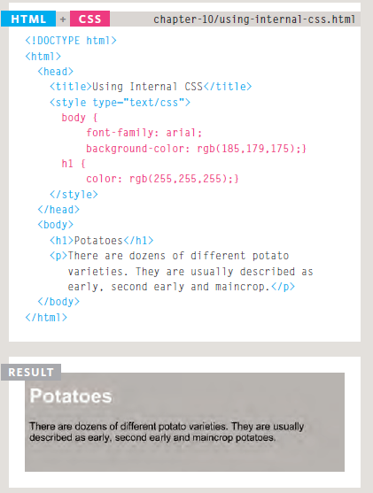
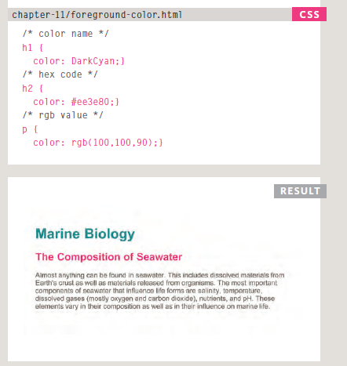
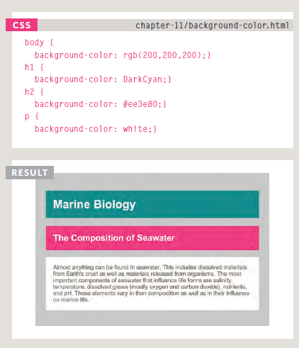

# Introducing CSS
## What CSS does
## CSS stands for Cascading Style Sheets. It is the coding language that gives a website its look and layout. Along with HTML, CSS is fundamental to web design. Without it, websites would still be plain text on white backgrounds.

## CSS Properties Affect How El ements Are Displayed:
## CSS declarations sit inside curly brackets and each is made up of two parts: a property and a value, separated by a colon. You can specify several properties in one declaration, each separated by a semi-colon.

## Using Internal CSS
## <style>You can also include CSS rules within an HTML page by placingthem inside a <style> element,which usually sits inside the <head> element of the page.The <style> element should use the type attribute to indicate that the styles are specified in CSS. The value should be text/css.

## Color

## How to specify colors

## The color property allows you to specify the color of text inside an element. You can specify any color in CSS in one of three ways: 
### rgb values 
### These express colors in terms of how much red, green and blue are used to make it up. For example: rgb(100,100,90)
### hex codes These are six-digit codes that represent the amount of red, green and blue in a color, preceded by a pound or hash # sign. For example: #ee3e80 
### color names There are 147 predefined color names that are recognized by browsers. For example: DarkCyan

## background-color
## CSS treats each HTML element as if it appears in a box, and the background-color property sets the color of the background for that box. You can specify your choice of background color in the samethree ways you can specify
1. foreground colors: RGB values
2. hex codes
3. color names

